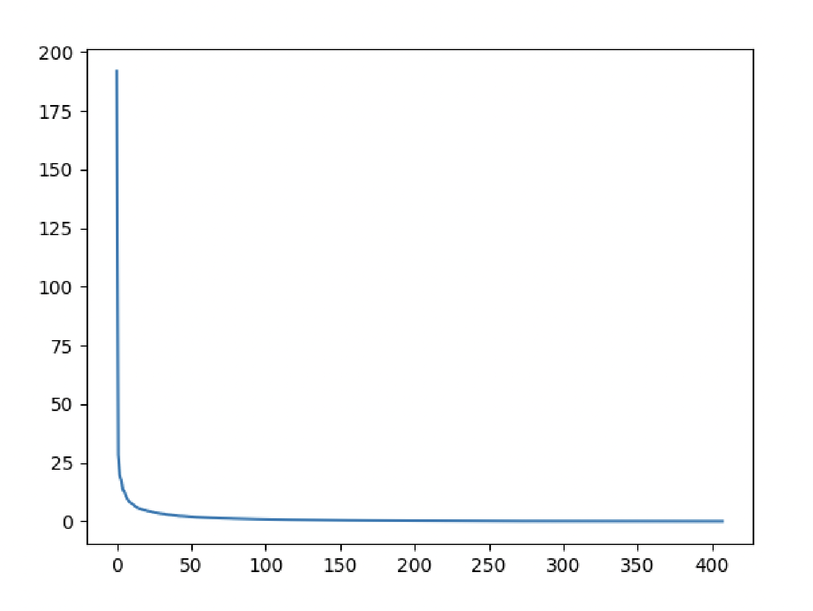

To see if an approximation is reasonable, we can check the values in `s`
by plotting them. 
```python
plt.plot(s)
plt.show()
```
<style>
img {
  display: block;
  margin-left: auto;
  margin-right: auto;
}
</style>


In the graph, we can see that although we have 408 singular values in `s`, 
most of those (after the 150th entry or so) are pretty small. So it might 
make sense to use only the information related to the first (say, 50) 
singular values to build a more economical approximation to our image.

The idea is to consider all but the first `k` singular values in `Sigma` 
(which are the same as in `s`) as zeros, keeping `U` and `Vt` intact, and 
computing the product of these matrices as the approximation.

## Task
Build an image approximation by computing the product of the orthogonal matrices and the
first `k = 20` singular values of the diagonal matrix.
Note that you have to use only the first `k` rows of `Vt`, since all other rows would be 
multiplied by the zeros corresponding to the singular values we eliminated from this approximation.
Run the script to see the result.

For this example, we chose `k = 20`, but you're encouraged to
go ahead and repeat this experiment with other values of `k`.  
Each of your experiments should give you a slightly better (or worse) 
image depending on the value you choose.

<div class="hint">

Use slicing on matrices `Sigma` and `Vt`.
</div>

<div class="hint">
The original matrix can be reconstructed as a product of the three matrices obtained with the SVD.
</div>