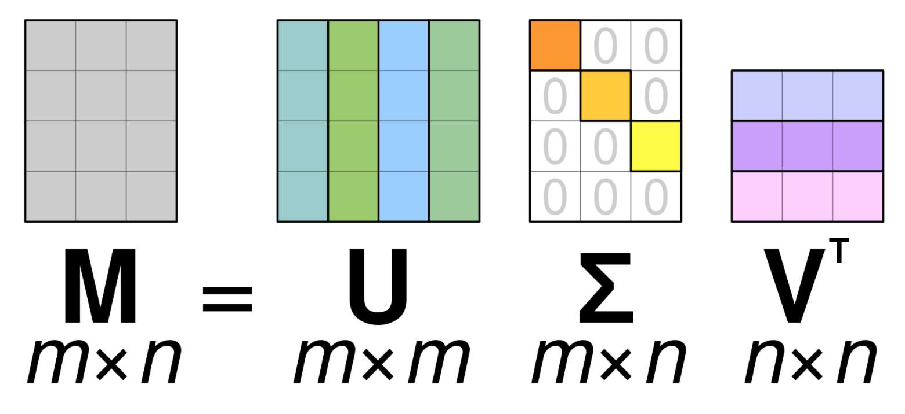

The way images are represented (as a 3D matrix) can
ultimately result in a large amount of memory used to
produce a single image. For instance, to save a
100 × 100 image in grayscale, 10,000
different pixel values would be stored. 
One way to enable computers to save images without taking up large amounts of memory (to approximate the data) is
to use methods from linear algebra, such as [Singular Value
Decomposition](https://en.wikipedia.org/wiki/Singular_value_decomposition) (SVD). It allows compressing the size of the saturation
matrices while retaining the most important components, i.e., saving
an image using less memory while preserving the image
quality.

Here, we will use the SVD to rebuild an image that 
uses less singular value information than the original one while still retaining many of its features.

><i><b>Note</b>: We will use NumPy’s [linalg](https://numpy.org/devdocs/reference/routines.linalg.html#module-numpy.linalg) 
> module to perform the operations in this tutorial. Most of the linear algebra functions in this module 
> can also be found in [scipy.linalg](https://docs.scipy.org/doc/scipy/reference/linalg.html#module-scipy.linalg), and you are generally encouraged to use the [scipy](https://docs.scipy.org/doc/scipy/reference/index.html#module-scipy) module for real-world 
> applications. However, some functions in the `scipy.linalg` module, such as the SVD function, 
> support only 2D arrays. For more information on this, check the [scipy.linalg Reference](https://docs.scipy.org/doc/scipy/reference/tutorial/linalg.html). </i>

In order to extract information from a given matrix, we can use the SVD to obtain 3 arrays which 
can be multiplied to obtain the original matrix. From the theory of linear algebra, given a real $m \times n$ matrix $A$, 
the following product can be computed:

$$U\Sigma V^T = A$$

where $U$ is an $m \times m$ complex unitary matrix, and $V$ is an $n\times n$ complex unitary matrix. $\Sigma$ is an $m\times n$ rectangular diagonal matrix with
non-negative real numbers on the diagonal, organized from largest to smallest.
These values can be used as an indicator of the "importance" of some features represented by the matrix $A$.
$U$ and $V^T$ are [orthogonal](https://en.wikipedia.org/wiki/Orthogonal_matrix) matrices.

