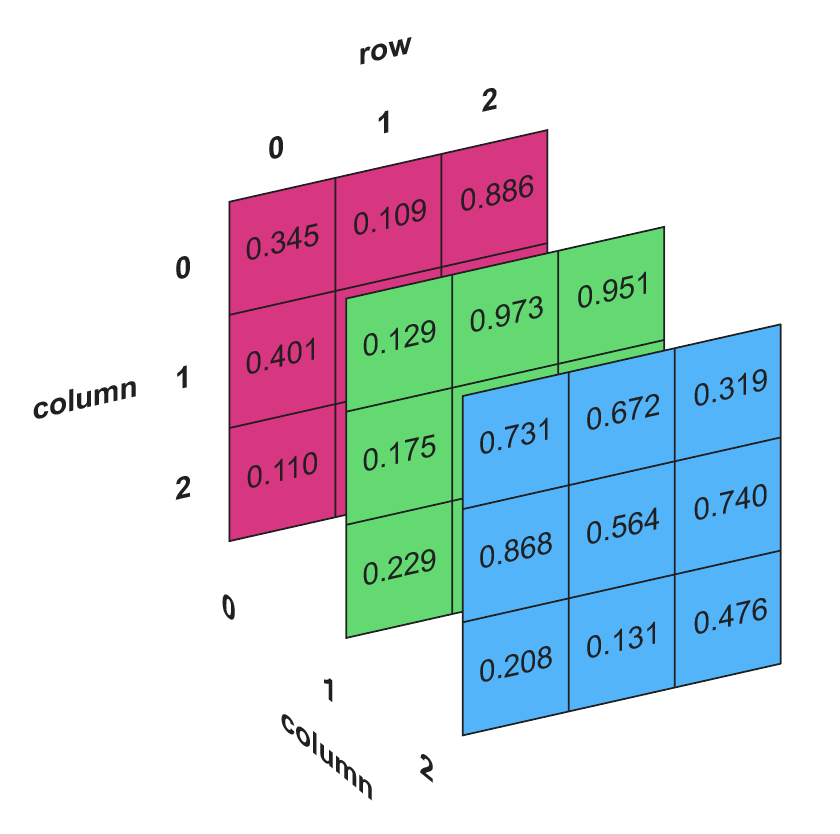

Remember that our data is organized in three 2D arrays representing color channels 
– red, green, and blue (in this order). Therefore, by slicing the data on the third axis, 
we can assign each color channel to a separate matrix.

### Task 
Assign each color channel to a separate matrix using the slice syntax.
